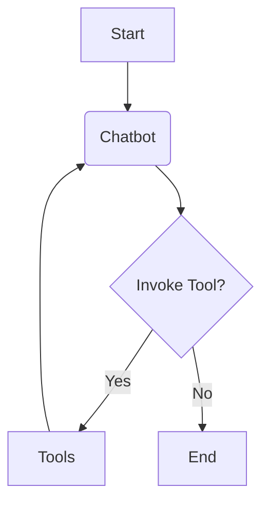

# 🌐 LangGraph Multi-Agent Workflow

This repository demonstrates how to build stateful, multi-agent language model workflows using LangGraph, a powerful framework that combines modular agent design with graph-based logic.

## 📁 Project Structure

Each file in this project contributes to a flexible and scalable architecture:

*   `main.py`: Initializes the LangGraph workflow, defines agent nodes, and sets up graph transitions to control the flow between agents.
*   `agents.py`: Implements modular, reusable agents responsible for specific tasks or decision-making within the workflow.
*   `memory.py`: Manages persistent state, allowing agents to access and update context across interactions.
*   `config.py`: Stores configurable settings like agent parameters, API keys, and graph rules.
*   `api.py` (optional): Exposes the workflow through a FastAPI interface for integration with external services.
*   `utils.py`: Contains helper functions for logging, data processing, and integration with LangSmith for tracking and debugging.

## 🚀 Core Concepts

This project is built on the following LangGraph principles:

*   ✅ **Stateful Workflows**: Preserve and evolve conversation or task state across multiple steps and agent interactions.
*   🤖 **Agents**: Modular components that encapsulate task logic, user interaction, or decision-making.
*   🔁 **Graph Structure**: Workflows are represented as directed graphs. Each node is an agent, and edges define valid transitions.
*   🔄 **Transitions**: Flow is controlled by agent output and current state. Transitions enable flexible routing between agents.
*   🧠 **Memory**: Agents can store and retrieve context across the workflow, improving coherence and decision quality.
*   🧪 **Experiment Tracking**: LangSmith integration allows for tracking performance, debugging, and evaluating agent behavior.

## ✨ Features

*   🔗 Multi-agent orchestration
*   📈 Graph-based workflow logic
*   🧩 Modular and reusable agent design
*   💾 Persistent memory across steps
*   🛠️ Easily extendable with custom nodes, APIs, and logic
*   🌐 (Optional) API exposure via FastAPI
*   🧠 Integrated with LangSmith for observability and debugging

## 🛠 Technologies Used

| Tool         | Purpose                                                 |
|--------------|---------------------------------------------------------|
| LangGraph    | Graph-based LLM workflow framework                      |
| LangChain    | LLM orchestration and chaining logic                    |
| LangSmith    | Experiment tracking and debugging tool                  |
| Python       | Core development language                               |
| OpenAI API   | For LLM tasks (if applicable)                           |
| FastAPI      | For exposing workflows as APIs (if implemented)         |
| NetworkX     | For graph structure and transitions (if used in visualization) |

## 🧠 Key Terminology

*   **Node**: A single processing unit or agent in the workflow.
*   **Edge**: A directed connection representing a transition between nodes.
*   **State**: Contextual data shared across agents.
*   **Action**: Task or operation performed by an agent.
*   **Context**: All available information to an agent at a specific step.

## 🔄 Project Workflow

Below is a simplified visual representation of the graph-based agent interaction:

## 📜 License
This project is licensed under the MIT License.

## 🙌 Contributions
Pull requests, issues, and ideas are welcome! Let’s build smarter agent workflows together.
